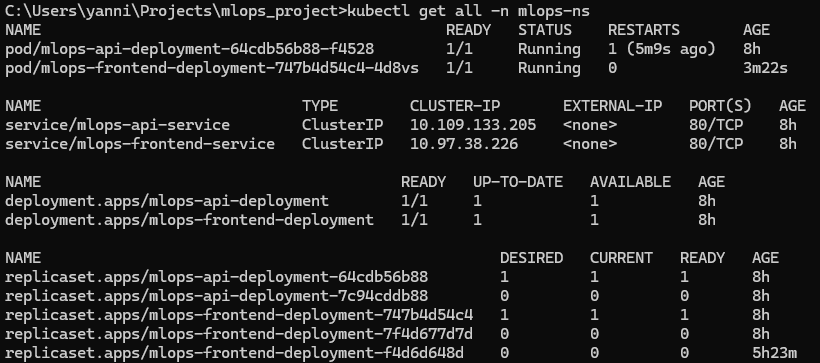

# Report MLOps Project - Yannick Vanneste

Github Link: https://github.com/YannickVa/mlops_project

## 1. Introduction
The primary objective of this project is to demonstrate a comprehensive, end-to-end Machine Learning Operations (MLOps) workflow. The project moves beyond the theoretical construction of a model to address the practical challenges of its entire lifecycle: automated training, robust deployment, and continuous integration and development.

### 1.1 The Machine Learning Use Case
The underlying machine learning task is a binary classification problem focused on predicting customer damage incidence. This is part of a project I did for the course 'Machine Learning'. The model is a Support Vector Classifier (SVC) trained on a pre-processed tabular dataset (train_cleaned.csv). The training process, encapsulated in a reusable Python script (ml/train.py), includes essential preprocessing steps such as data shuffling, feature scaling using StandardScaler, and handling class imbalance with the Synthetic Minority Over-sampling Technique (SMOTE). The final trained artifacts are the SVC model and the scaler, saved as .joblib files.

### 1.2 MLOps Objectives
This project implements a full MLOps pipeline designed to automate and manage the model's lifecycle, directly addressing the core tasks of the assignment:
* Task 1: Cloud-Based Training: To establish a repeatable and scalable training process within a cloud environment using Azure Machine Learning services.
* Task 2: Containerized Deployment: To deploy the trained model as a production-ready, multi-service application on a Kubernetes cluster, featuring a distinct API backend and a user-facing web frontend.
* Task 3: CI/CD Automation: To create automated workflows using GitHub Actions that handle the retraining of the model and the redeployment of the application in response to changes in code or data, minimizing manual intervention.

## 2. System Architecture
The project is implemented as a cohesive system with distinct components responsible for training, serving, and automation. The overall architecture illustrates the flow of data and actions across the entire MLOps lifecycle. The system is designed around a central Git repository, which serves as the single source of truth for application code, infrastructure definitions, and the versioned model artifact itself.

The architecture is composed of three primary operational loops: 

**The CI/CT Loop (Continuous Integration & Continuous Training)**: Triggered by changes to the model's source code or data, this workflow (detailed in Section 3) uses GitHub Actions to orchestrate the training job on Azure ML. Upon successful completion, it automatically downloads the new model artifacts and commits them back into the repository, ensuring the model is always version-controlled and in sync with the data it was trained on.

**The CI/CD Loop (Continuous Integration & Continuous Deployment)**: Triggered by changes to the application's source code (API or frontend) or by a new model being committed, this workflow (detailed in Section 5) builds new, version-tagged Docker images. These images are pushed to the GitHub Container Registry (GHCR). For this project's local Kubernetes setup, the final deployment step is performed manually, but the pipeline is designed for full automation in a cloud environment.

**The Serving Loop**: Within the Kubernetes cluster (detailed in Section 4), user traffic is managed by an NGINX Ingress, which directs requests to the Flask-based frontend. The frontend, in turn, communicates with the FastAPI backend via an internal ClusterIP service to retrieve predictions. This microservice architecture ensures a clean separation of concerns between the user interface and the model inference logic.

## 3. Task 1: Repeatable Cloud Training with Azure ML
To fulfill the requirement of training the model in a cloud environment, Azure Machine Learning (Azure ML) was selected. The primary goal was not merely to execute the training script in the cloud, but to establish a robust, version-controlled, and repeatable process. This was achieved by treating our cloud infrastructure as code, defining all necessary components in YAML configuration files.

### 3.1 Defining the Training Environment
The entire training process is defined by three key YAML manifests, which live within the project's azure-ml/ directory. This approach ensures that the exact conditions of any training run can be perfectly replicated and version-controlled in Git.
1. **Compute Target (compute.yml)**: A scalable compute cluster was defined to execute the training job. The cluster is configured to automatically scale down to zero nodes when idle to minimize costs, a critical feature for production environments.
2. **Software Environment (environment.yml)**: The training script's runtime environment is explicitly defined. It is built from a base Azure ML image and a custom Dockerfile that installs the exact Python dependencies specified in the project's poetry.lock file (via an exported requirements.txt). This guarantees that every training run uses the exact same package versions, eliminating environment-related inconsistencies.
3. **Training Job (job.yml)**: This manifest is the blueprint for the training run itself. It connects all the components, specifying:
* The command to execute (python ml/train.py).
* The registered Azure ML Data Asset to use as input.
* The compute cluster to run on.
* The software environment to use.
* The expected location for the output model artifacts.

The following code snippet shows the core of the job.yml file, illustrating how these components are tied together.
```yaml
command: >-
  python ml/train.py
  --data_path ${{inputs.training_data}}
  --model_output_path ${{outputs.model_output}}
code: ..
inputs:
  training_data:
    type: uri_file
    path: azureml:training-data:1
outputs:
  model_output:
    type: uri_folder
environment: azureml:mlops-env:1
compute: azureml:cpu-cluster
experiment_name: damage-incidence-prediction

```

### 3.2 Executing and Monitoring the Training Job
The training process is initiated by an orchestration script (scripts/run_azure_training.py) which uses the Azure CLI to create or update the resources defined in the YAML files and submits the job. This script forms the basis of our automated CI/CD pipeline.

Upon successful submission, the job can be monitored directly in the Azure ML Studio. The Studio provides a comprehensive view of the job's status, parameters, and, most importantly, its outputs.


*Figure 2: A successful run of the svc-training-job as seen in the Azure ML Studio Jobs tab.*

Once the job is complete, the resulting model and scaler artifacts are stored in the Azure ML run's associated storage. The "Outputs + logs" tab allows for easy inspection and download of these critical files.


*Figure 3: The model and scaler artifacts (svc_model.joblib and scaler.joblib) are correctly saved internally.*

## 4. Task 2: Kubernetes Microservice Deployment
With a trained model available, the next stage is to deploy it as a robust and scalable application. For this, a containerized microservice architecture was implemented and deployed to a Kubernetes cluster running via Docker Desktop. This approach provides a clear separation of concerns between the user interface and the model inference logic.

The application consists of two primary services:
* **Frontend Service**: A Flask web application that serves the user interface, allowing users to input data via a web form.
* **API Service**: A FastAPI application that exposes the trained SVC model via a RESTful API endpoint, handling the core machine learning inference.

### 4.1 Kubernetes Resources and Architecture
The entire application is defined as a set of Kubernetes manifest files in the k8s/ directory. All resources are deployed within a dedicated namespace, mlops-ns, to ensure logical isolation within the cluster.

The interaction between the services is orchestrated by Kubernetes networking objects.

User traffic is managed by:
* An NGINX Ingress Controller, which acts as the single entry point for all external traffic to the mlops-ns namespace. It routes incoming requests for the root path (/) to the frontend service.
* The Frontend Service (mlops-frontend-service), a ClusterIP service, provides a stable internal endpoint for the frontend pods.
* The Frontend Deployment runs the Flask application container. When a user submits a prediction request, this service makes an HTTP request to the API service using its internal Kubernetes DNS name.
* The API Service (mlops-api-service), also a ClusterIP service, provides a stable internal endpoint for the API pods.
* The API Deployment runs the FastAPI application container, which loads the model artifacts and performs the prediction.

This architecture ensures that the API service is not directly exposed to the public internet, enhancing security. The use of an Ingress provides a flexible and production-ready way to manage traffic.

### 4.2 The API and Frontend in Action
The deployed application is fully functional. The FastAPI service provides automatic, interactive API documentation via its /docs endpoint, which is invaluable for development and testing.


*Figure 4: The interactive API documentation provided by FastAPI at the /docs endpoint.*

The user interacts with a simple but effective web interface served by the Flask frontend. This allows for easy submission of data to the model and a clear presentation of the prediction result.


*Figure 5: The web frontend, allowing a user to input data for prediction.*

The successful deployment and operation of these services within the Kubernetes cluster can be verified using kubectl. The following command confirms that all pods, services, deployments, and the ingress are running as expected within the mlops-ns namespace.



Figure 6: Output of kubectl get all -n mlops-ns showing all resources in a running state.

## 5. Task 3: Automation with GitHub Actions CI/CD
A core objective of this project was to minimize manual intervention by implementing robust Continuous Integration and Continuous Delivery (CI/CD) pipelines. GitHub Actions was used to create two distinct, automated workflows that manage the entire model and application lifecycle.

### 5.1 Task 3.1: Automated Model Retraining (CI/CT)
The first workflow, defined in .github/workflows/train_model.yml, establishes a Continuous Training (CT) pipeline. This workflow ensures that our model artifact is never stale and always reflects the latest state of our code and data.
Trigger: This workflow is automatically triggered by a push to the main branch that includes changes in model-specific directories (ml/, data/) or dependency files (pyproject.toml).
Process:
1. The workflow begins by setting up a Python environment and logging into Azure using a secure Service Principal stored in GitHub Secrets.
2. It executes our scripts/run_azure_training.py script, which orchestrates the creation of resources and submission of the training job on Azure ML.
3. Upon successful completion of the Azure ML job, a subsequent job in the workflow downloads the newly trained model artifacts (.joblib files).
4. In a crucial GitOps step, the workflow then automatically commits these new artifacts back to the ml/artifacts/ directory in the repository. This ensures the model is version-controlled alongside the code and triggers the application deployment workflow. An if condition in the workflow prevents an infinite loop of triggers.

The success of this automated training and commit-back process is visible in the GitHub Actions logs.


*Figure 7: A successful run of the "Train Model in Azure ML" workflow, showing the automated training, download, and commit jobs.*

**Model Versioning**: Model versions are tracked implicitly through Git. Since each new model is tied to a specific commit hash, we have a complete, auditable history of every model version and the exact state of the codebase that produced it. The Azure ML Job Name (e.g., dynamic_brush_...) is also captured in the commit message, linking the artifact directly to its cloud training run.

### 5.2 Task 3.2 & 3.3: Automated Application Deployment (CI/CD)
The second workflow, .github/workflows/deploy_app.yml, handles the Continuous Integration and Continuous Delivery of the application itself.

**Trigger**: This workflow is triggered by a push to main that includes changes to the application code (api/, frontend/, k8s/) or, importantly, by the model training workflow committing new artifacts to ml/artifacts/.

Process:
1. Build & Push: The workflow builds new Docker images for both the API and frontend services. These images are tagged with the short Git commit SHA for unique versioning. They are then pushed to the GitHub Container Registry (GHCR).
2. Update Manifests: The Kubernetes deployment files (k8s/api-deployment.yml and k8s/frontend-deployment.yml) are then automatically updated within the workflow runner using sed to point to the newly created image tags.
3. Manual Deployment Step: For this project, which targets a local Docker Desktop Kubernetes cluster, the workflow concludes by providing the user with the kubectl apply -f k8s/ command. This final manual step is a deliberate design choice to avoid the security risks and complexity of connecting a public CI/CD runner to a local machine's Kubernetes instance. In a cloud-native environment (e.g., using Azure Kubernetes Service), this step would be fully automated.


*Figure 8: A successful run of the "Build and Deploy Application" workflow, showing the image build, push, and manifest update steps.*

**Kubernetes Update Strategy**: When kubectl apply is run, Kubernetes handles the update gracefully. By default, the Deployment resource uses a RollingUpdate strategy. This strategy ensures zero downtime by incrementally replacing old pods with new ones. It will create a new pod with the new container image, wait for it to be ready, and only then terminate an old pod, ensuring the application remains available throughout the update process. This is the ideal strategy for a stateless web application like ours.

## 6. Reflection and Conclusion
This project was a practical and intensive journey through the core principles of modern Machine Learning Operations. The final result is a complete, automated system that successfully moves a machine learning model from a local script to a version-controlled, cloud-trained, and production-deployed application. The process underscored that MLOps is less about a single tool and more about the integration of practices, automation, and a security-first mindset.

### 6.1 Key Learnings
The project provided significant insights into several key areas:
* **Infrastructure as Code (IaC) is Non-Negotiable**: Defining cloud resources (Azure ML) and deployment targets (Kubernetes) in version-controlled YAML files proved to be the most critical practice. It made the system transparent, repeatable, and laid the foundation for all subsequent automation.
* **Git as the Single Source of Truth**: The "GitOps" approach for managing the model artifact—where the CI/CD pipeline automatically commits the newly trained model back to the repository—was a powerful pattern. It ensures there is never a question about which model version is in production and provides a clear, auditable history.
* **The Importance of Environment Parity**: The most subtle and frequent challenges arose from minor differences between the local development environment and the CI/CD runner environment. This was seen in Python version discrepancies (3.10 syntax failing in a 3.9 runner) and tooling versions (Poetry export command). It reinforced the need for explicit environment definitions, such as specifying the Python version in workflows and using Dockerfiles.

### 6.2 Significant Challenges and Solutions
While the project was successful, the path was not without significant technical hurdles. These challenges, however, provided the most valuable learning experiences.

**Problem**: *The GitHub Personal Access Token (PAT) Dilemma*

The single most challenging issue was authenticating with the GitHub Container Registry (GHCR). The initial plan to use a modern, fine-grained PAT failed repeatedly, as the required "Packages" permission was not available in the token creation UI.

**Solution**: The resolution was to pivot to using a "Token (classic)". While having broader permissions, it was the correct and officially supported method for the account type in use. This experience was a powerful lesson in how platform-specific nuances can have a major impact on implementation and the importance of adapting to the actual environment rather than a theoretical one.

**Problem**: *Python version disparity*

Initially, the python version used was 3.9, which caused problems in some used packages.

**Solution**: Simply changing python version to 3.10 proved a solid fix. Choosing to downgrade other packages could also have been an option.

Other notable challenges included resolving Windows-specific pathing issues for the Azure CLI in Python's subprocess module and debugging Azure ML YAML syntax to meet the strict schema requirements of the cloud provider.

### 6.3 Future Improvements
The current system is a complete and robust solution for the project's requirements. For a real-world, large-scale production system, the following enhancements could be considered:
* **Full Continuous Deployment**: The final kubectl apply step is currently manual as a security precaution for the local Docker Desktop cluster. In a cloud environment like Azure Kubernetes Service (AKS), the deployment workflow would be extended to authenticate to the cluster and run kubectl apply automatically, achieving true end-to-end deployment.
* **Externalized Model Storage**: While GitOps for the model works perfectly for this project, models can grow to many gigabytes in size. For such cases, the model artifact could be stored in a dedicated model registry (like Azure ML's) and downloaded by the API service on startup, keeping the Docker image small and the Git repository lean.
* **Advanced Kubernetes Configuration**: For managing more complex applications, one might introduce tools like Helm or Kustomize to template and manage the Kubernetes YAML manifests, making them more modular and reusable.

### 6.4 Conclusion
This project successfully demonstrates a complete MLOps workflow, from automated cloud training to a CI/CD-driven Kubernetes deployment. It proves that by combining principles of Infrastructure as Code, GitOps, and robust automation, it is possible to create a resilient, maintainable, and efficient ecosystem for a machine learning application. The challenges encountered were not setbacks but integral parts of the learning process, highlighting the real-world complexities of building production-grade systems.


